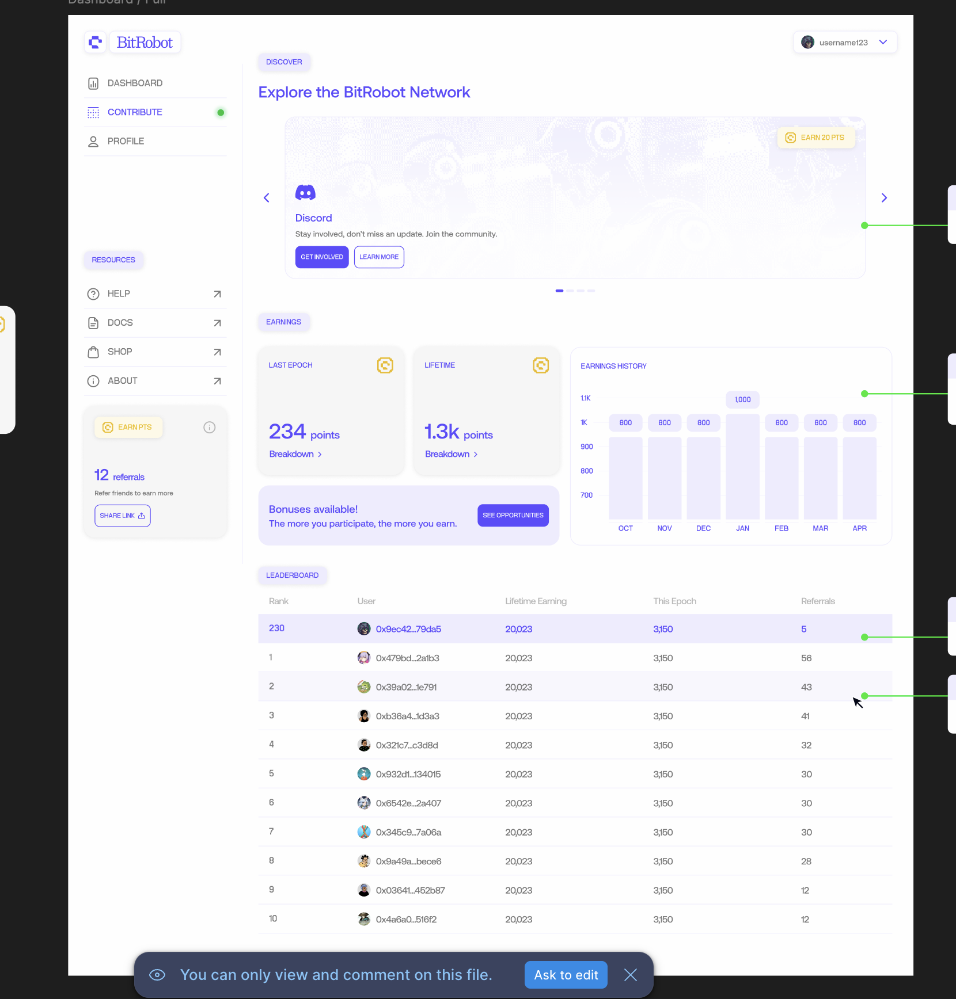
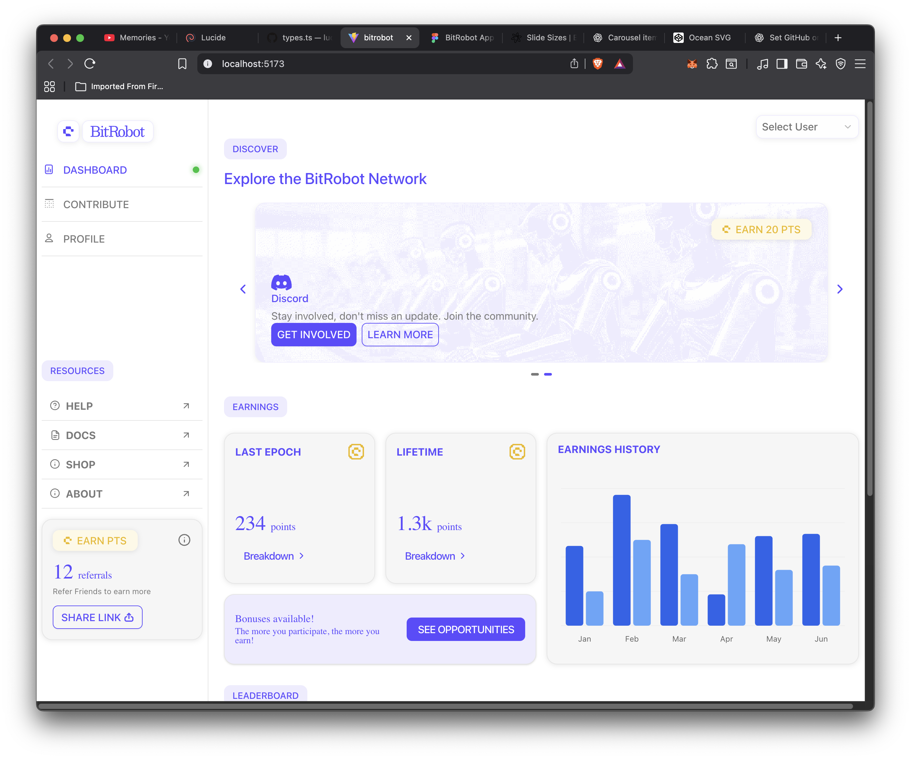
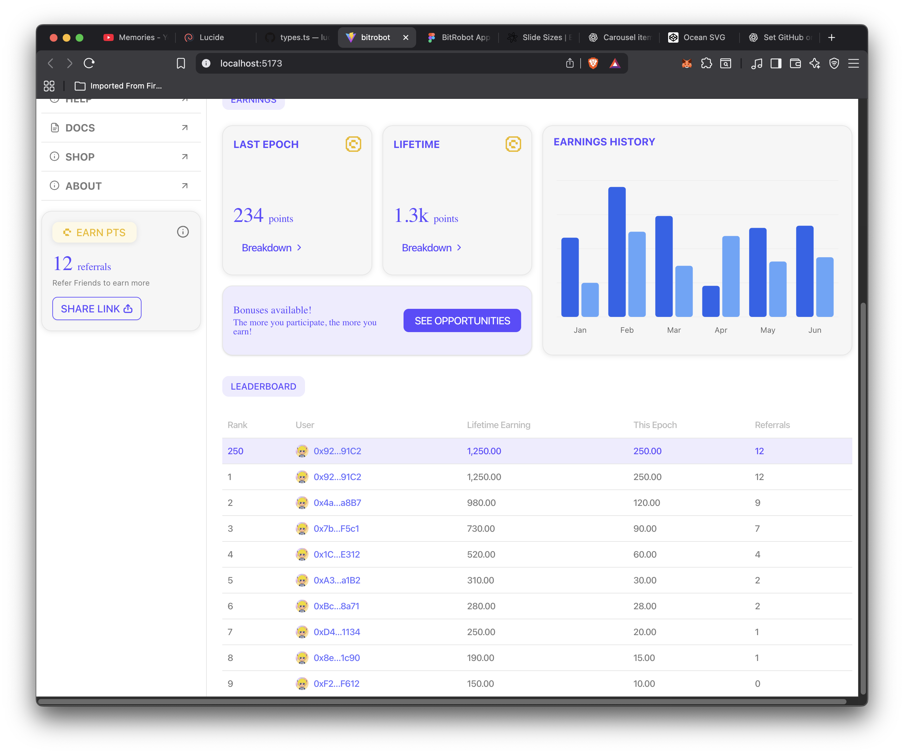

# 🤖 Takehome frontend — React + TypeScript + Vite + Tailwind


---

```bash
# Install & Run
pnpm install
pnpm dev   # open http://localhost:5173

# Build
pnpm build

# Lint
pnpm lint
```


---


### Design Reference



### My Implementation





---

### **Simplifications & Known Issues**

These are intentional due to scope and limited access:

* **Not responsive yet** — the layout is desktop-only for 1280px width.

  * Portions of the Figma (sidebar, main content spacing) appear to rely on absolute positioning, so responsiveness would require structural adjustments.

* **Default fonts** — final brand/typeface files weren’t available, so placeholder system fonts were used.


---

## Future Improvements

- [ ] Make layout fully responsive  
- [ ] Add proper brand fonts (including weights + variable fonts)  
- [ ] Refactor + reorganize components for clarity  
- [ ] Introduce a Typography component to reduce repetitive HTML + Tailwind classes  

A full implementation would begin with a reusable **design system / component library**.  
This slows down initial development slightly, but dramatically improves long-term velocity, reduces HTML noise, and ensures visual consistency across the entire project.

